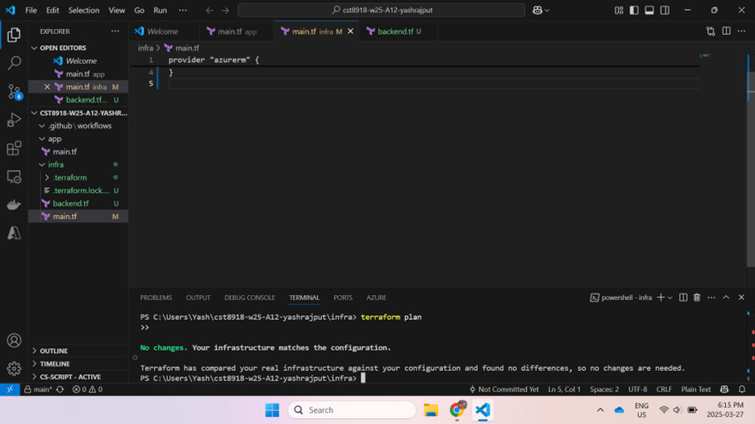
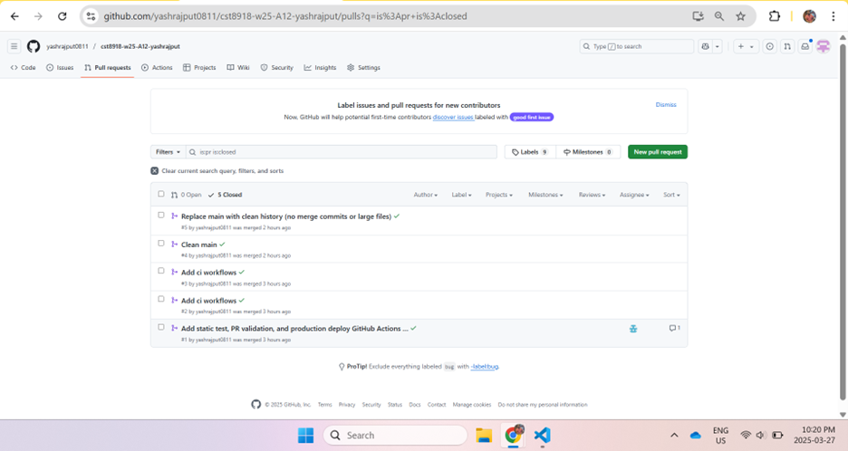

# CST8918 – Lab 12: Terraform CI/CD with GitHub Actions

## 📋 Objective

Automate infrastructure provisioning and management using Terraform and GitHub Actions by implementing:

- GitHub Actions for PR validation, static code checks, and deployment.
- CI/CD pipelines with branch-based environments (`main`, `add-ci-workflows`).
- Infrastructure drift detection.
- Secure backend setup for Terraform state in Azure.

---

## 📁 Folder Structure

```
.github/
 └── workflows/
      ├── static-test.yml
      ├── pull-request.yml
      ├── production-deploy.yml
      └── drift-detection.yml
infra/
 ├── main.tf
 ├── backend.tf
 ├── terraform.lock.hcl
 └── federated-credential/
       ├── branch-main.json
       ├── pull-request.json
       └── production-deploy.json
```

---

## ✅ GitHub Actions Workflow Summary

| Workflow               | Trigger                     | Branch                | Purpose                              |
|------------------------|-----------------------------|------------------------|--------------------------------------|
| Static Code Test       | On PR and Push              | All                   | Runs `terraform fmt` and `validate` |
| Pull Request Plan      | On PR                       | PR Branch → `main`    | Runs `terraform plan`               |
| Production Deploy      | On Push                     | `main`                | Runs `terraform apply`              |
| Drift Detection        | Scheduled (Daily)           | `main`                | Detects configuration drift         |

---

## 📸 Screenshots

### 1. Terraform Plan Output (`terraform plan`)
_After running `terraform plan` on the local machine._



---

### 2. Pull Request Successfully Merged
_Proof of CI/CD running and PR being merged into `main`._



---

## 🧹 Clean Commit History

- All large `.terraform` files removed.
- `.gitignore` updated to prevent future `.terraform` bloat.
- All commits are clean and merge commits avoided to comply with GitHub ruleset.

---

## 🧠 Notes

- Backend config secured using `backend.tf` with Azure Storage.
- Federated credentials used for GitHub Actions authentication.
- Followed GitHub rulesets: No force-push on `main`, no merge commits.
- I completed this lab **solo** as I did not find a teammate and wanted to challenge myself by doing the full lab alone.

---

## 📅 Date

**Lab Completed on:** March 27, 2025  
**Student:** Yash Rajput  
**Repo:** [GitHub - yashrajput0811/cst8918-w25-A12-yashrajput](https://github.com/yashrajput0811/cst8918-w25-A12-yashrajput)

---

## ✅ Status

All workflows passed ✔️ | History cleaned ✔️ | Resources destroyed ✔️
